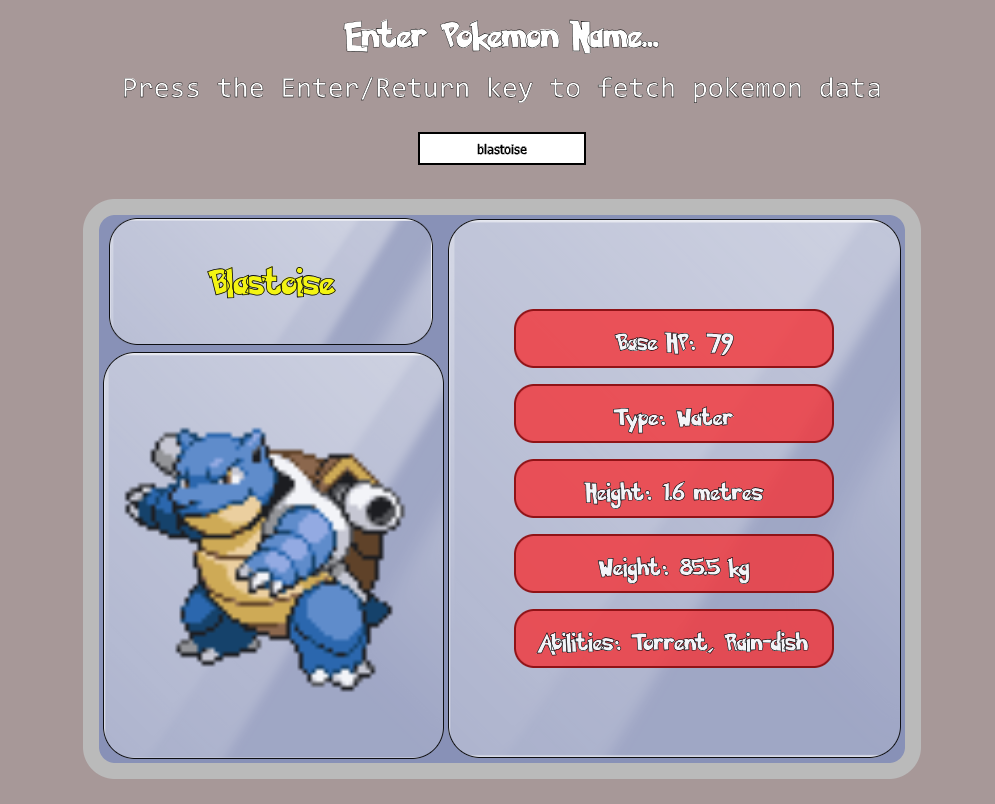

# Pokedex

---
A cozy simple pokedex interface using pokeapi.co RESTful API. Input the name of one of the original 150 Pokemon and returns some basic information about them.

This project was one of my first introductions to using API calls. This was a practise project that I would like to revisit in the future and build a revised Pokedex 2.0 as I think it could be improved visually and make it a bit more interactive and engaging.
